# Visual Documentation

**Architecture diagrams, flowcharts, and visual guides for the NZ Legislation Tool**

---

## System Architecture

### High-Level Architecture

This diagram shows the overall system architecture and data flow.

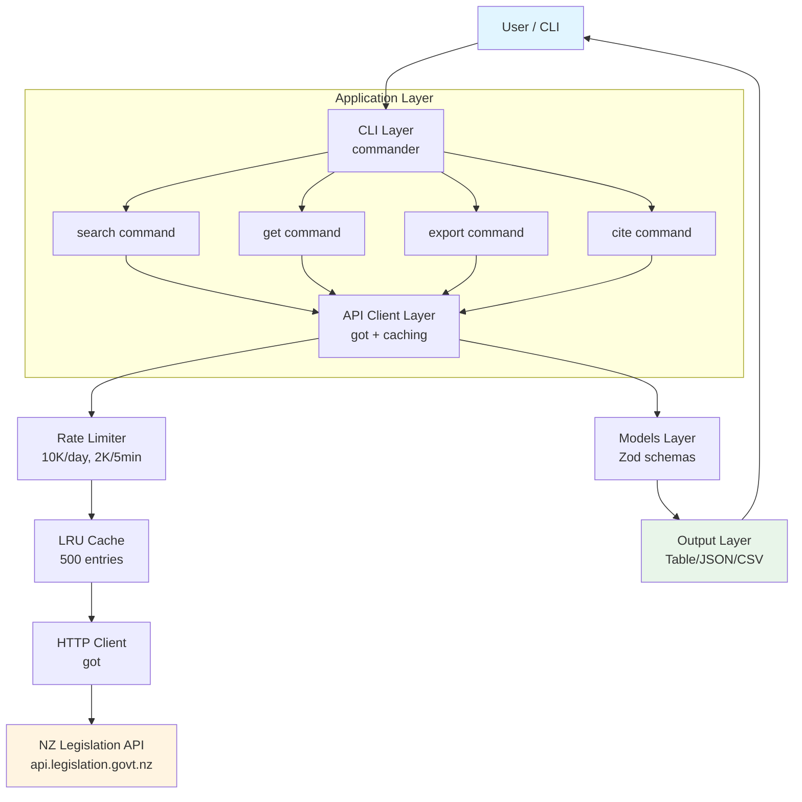

---

## Data Flow Diagrams

### Search Command Flow

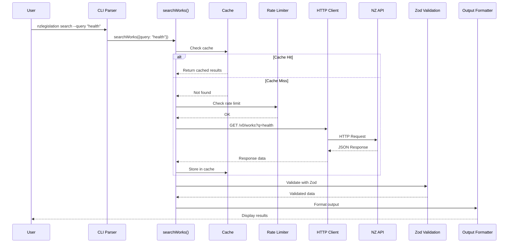

---

### Configuration Flow

```mermaid
flowchart TD
    Start[Application Start] --> LoadEnv[Load Environment Variables<br/>dotenv.config()]
    LoadEnv --> LoadConfig[Load Config File<br/>conf.get()]
    LoadConfig --> Merge[Merge Configuration<br/>Env > File > Defaults]
    Merge --> Validate{Validate with<br/>Zod Schema}

    Validate -->|Valid| Ready[Ready to Use<br/>export getConfig()]
    Validate -->|Invalid| Error[Error: Invalid Config<br/>throw ConfigError]

    style Start fill:#e1f5ff
    style Ready fill:#e8f5e9
    style Error fill:#ffebee
```

---

### Error Handling Flow

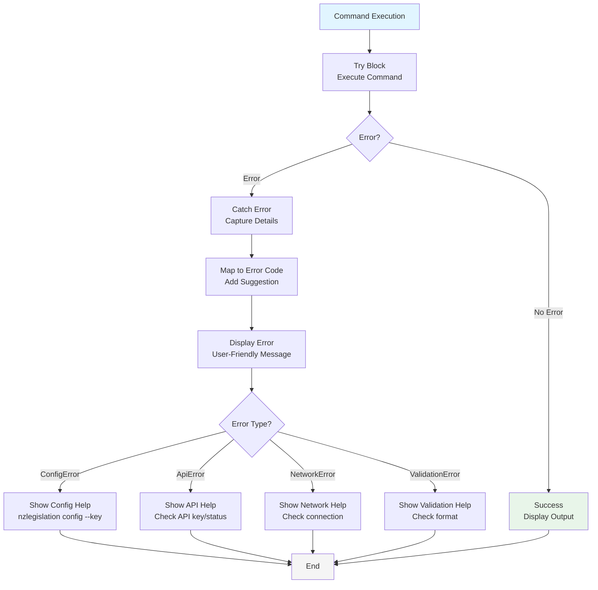

---

## Component Architecture

### Module Dependencies

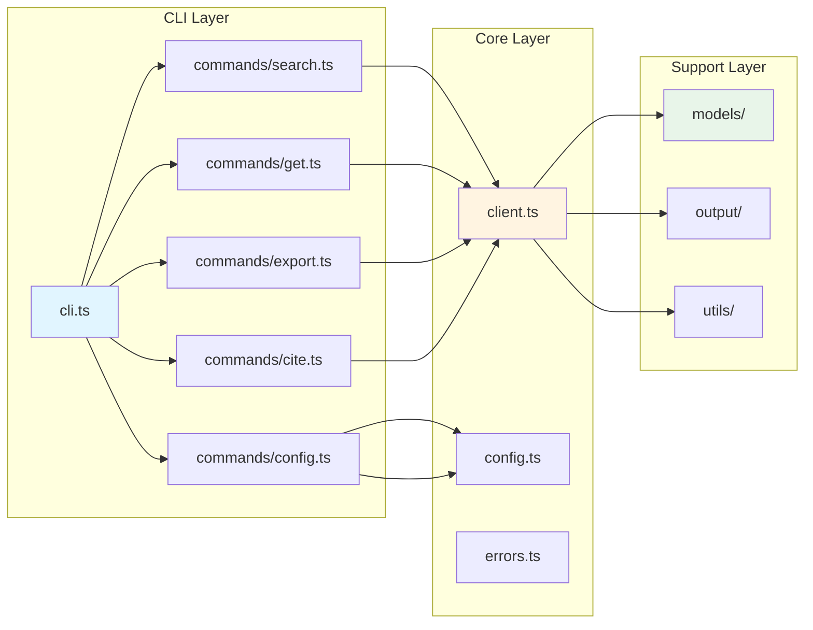

---

### Data Model Relationships

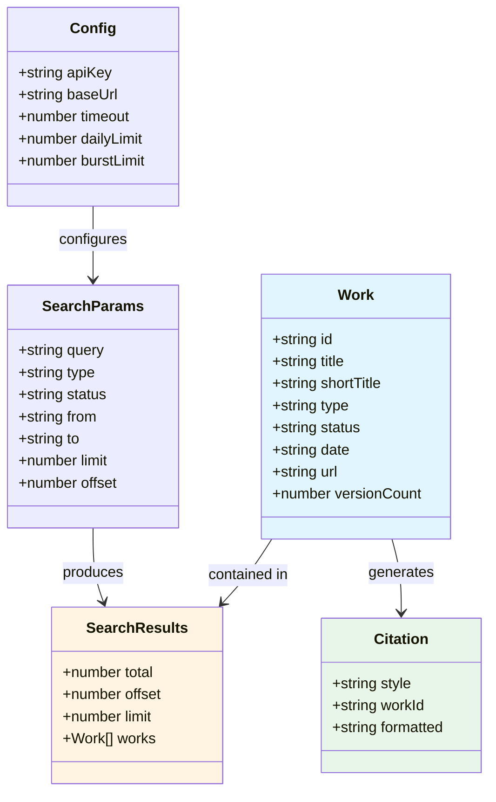

---

## Testing Architecture

### Test Pyramid

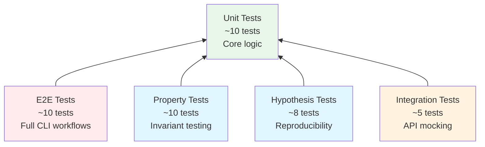

---

### Test Execution Flow

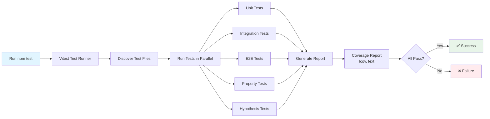

---

## Performance Architecture

### Caching Strategy

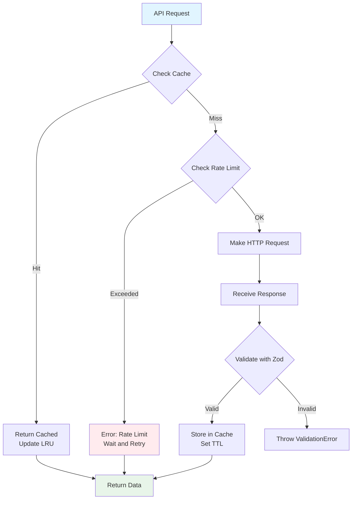

### Rate Limiting Strategy

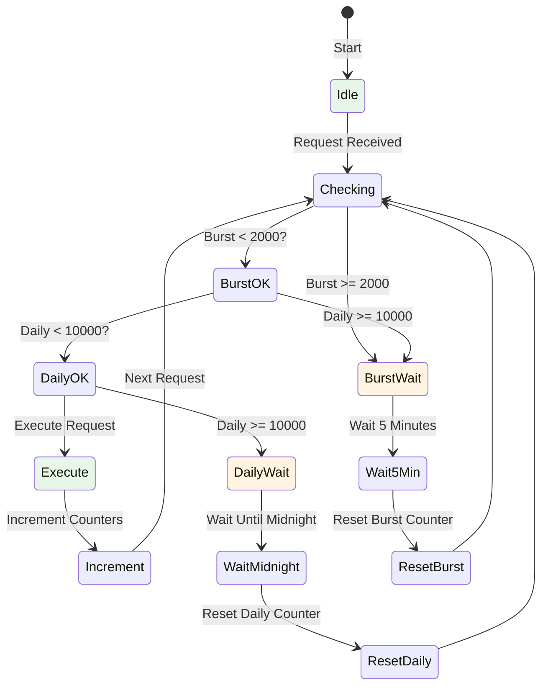

---

## Security Architecture

### API Key Flow

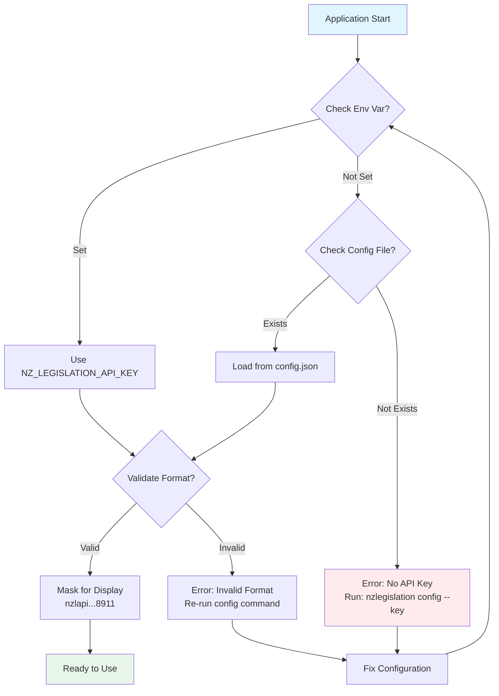

---

## User Workflows

### First-Time User Flow

```mermaid
flowchart TD
    Start[New User] --> Discover[Discover Tool<br/>GitHub/npm]
    Discover --> ReadME[Read README]
    ReadME --> Decide{Install?}

    Decide -->|Yes, Try First| NPX[Try with npx<br/>No install]
    Decide -->|Yes, Regular Use| NPM[Install with npm<br/>npm install -g]
    Decide -->|No| Leave[Leave]

    NPX --> GetKey[Get API Key<br/>api.legislation.govt.nz]
    NPM --> GetKey

    GetKey --> Config[Configure<br/>nzlegislation config --key]
    Config --> Test[Test<br/>nzlegislation search --query "health"]

    Test --> Success{Works?}
    Success -->|Yes| FirstSearch[First Successful Search]
    Success -->|No| Troubleshoot[Troubleshooting<br/>Check FAQ/docs]

    Troubleshoot --> Retry[Retry Configuration]
    Retry --> Test

    FirstSearch --> Export[Export Results]
    Export --> Cite[Generate Citation]
    Cite --> Regular[Regular User]

    style Start fill:#e1f5ff
    style Regular fill:#e8f5e9
    style Troubleshoot fill:#fff4e1
    style Leave fill:#f5f5f5
```

---

### Research Workflow

```mermaid
flowchart LR
    subgraph "Stage 1: Discovery"
        S1[Initial Search] --> Refine[Refine Search]
        Refine --> Review[Review Results]
    end

    subgraph "Stage 2: Data Collection"
        Review --> Export[Export Dataset]
        Export --> Details[Get Details]
        Details --> Batch[Batch Export]
    end

    subgraph "Stage 3: Analysis"
        Batch --> Excel[Open in Excel]
        Excel --> R[Analyze in R]
        R --> Python[Analyze in Python]
    end

    subgraph "Stage 4: Citation"
        Python --> CiteNZMJ[Cite NZMJ]
        CiteNZMJ --> CiteAPA[Cite APA]
        CiteAPA --> BibTeX[Cite BibTeX]
    end

    BibTeX --> Paper[Write Paper]

    style S1 fill:#e1f5ff
    style Export fill:#fff4e1
    style Excel fill:#e8f5e9
    style Paper fill:#f3e5f5
```

---

## Troubleshooting Flowcharts

### API Key Issues

```mermaid
flowchart TD
    Start[API Key Error] --> CheckMsg{Error Message?}

    CheckMsg -->|"API key not configured"| NotConfig[Run: nzlegislation config --key]
    CheckMsg -->|"Authentication failed"| AuthFail[Check API Key]
    CheckMsg -->|"Rate limit exceeded"| RateLimit[Wait & Retry]

    NotConfig --> EnterKey[Enter API Key]
    EnterKey --> Test[Test: search --query "test"]

    AuthFail --> FindEmail[Find Original Email]
    FindEmail --> CopyKey[Copy Key Carefully]
    CopyKey --> Reconfig[Run: config --key NEW_KEY]
    Reconfig --> Test

    RateLimit --> Wait5[Wait 5 Minutes]
    Wait5 --> Retry[Retry Request]

    Test --> Success{Works?}
    Success -->|Yes| Done[✅ Done]
    Success -->|No| Contact[Contact Support<br/>GitHub Issues]

    Retry --> Success

    style Start fill:#ffebee
    style Done fill:#e8f5e9
    style Contact fill:#fff4e1
```

---

### Installation Issues

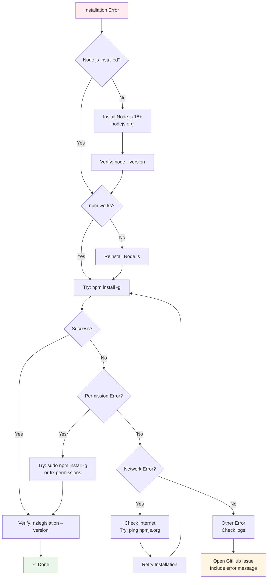

---

## Deployment Architecture

### CI/CD Pipeline

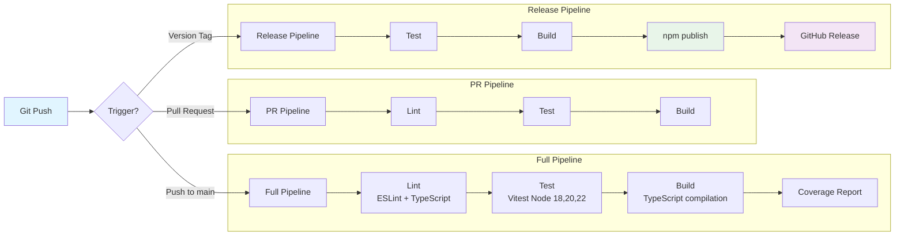

---

## Accessibility Notes

All diagrams are designed with accessibility in mind:

- **Text alternatives:** Each diagram includes a text description
- **Color contrast:** High contrast colors for visibility
- **Simple shapes:** Easy to parse for screen readers
- **Logical flow:** Clear start and end points
- **Consistent styling:** Predictable visual patterns

For users with screen readers, the text descriptions below each diagram provide the same information as the visual representation.

---

**Last Updated:** 2026-03-10  
**Version:** 1.0.0  
**Track:** Documentation Optimization & Humanization  
**Phase:** 5 - Visual Documentation
